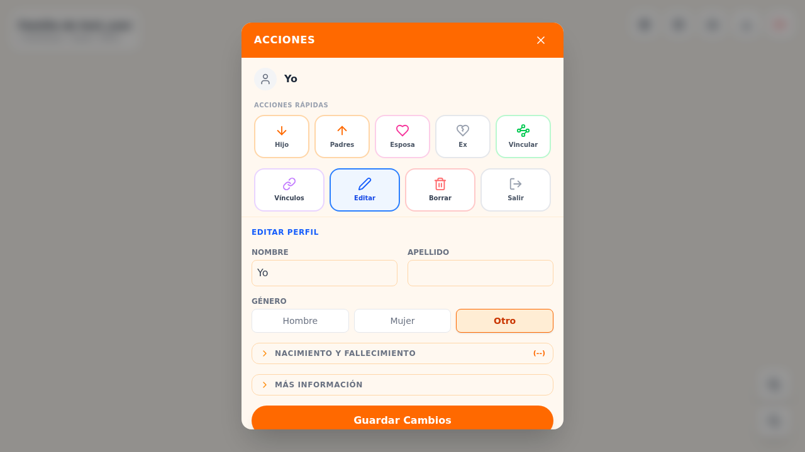
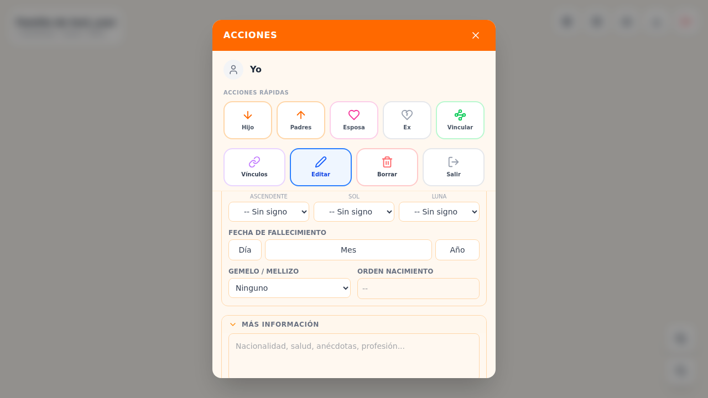
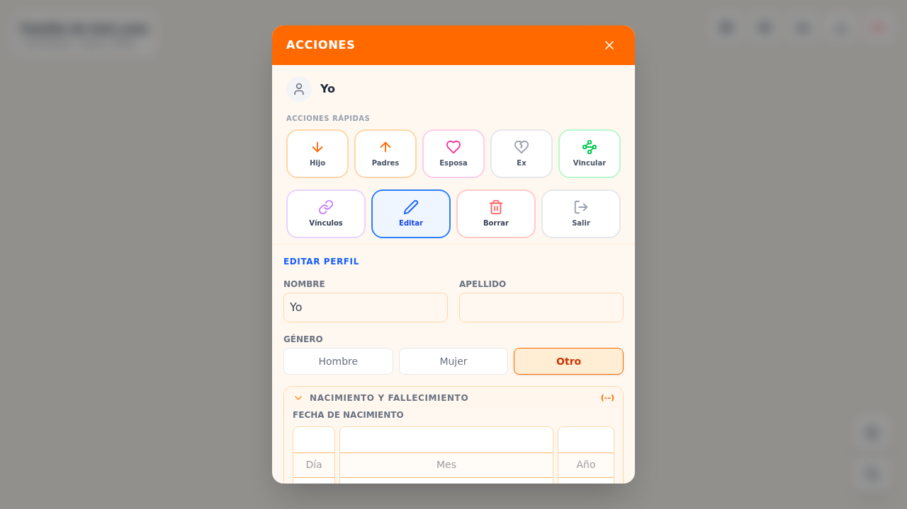
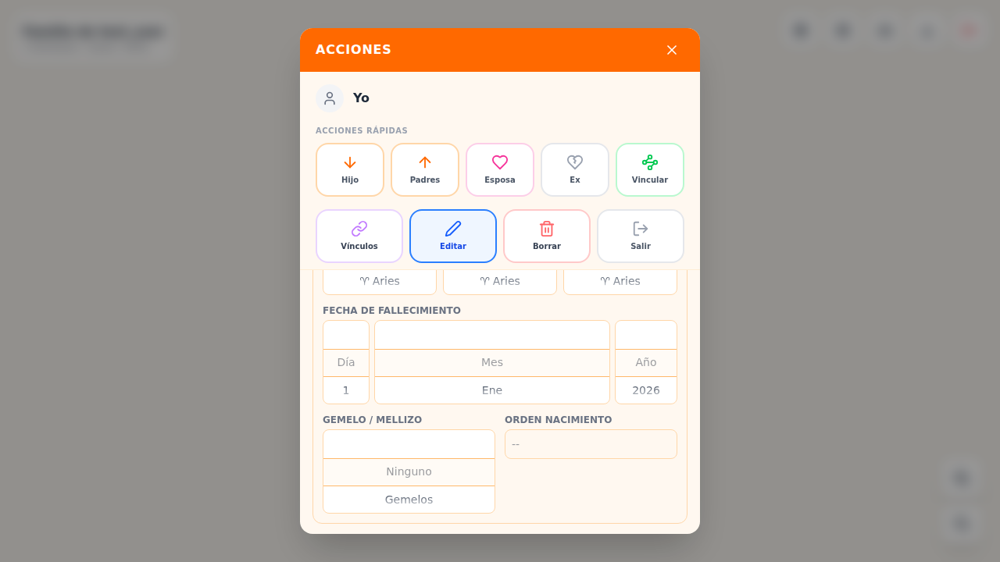
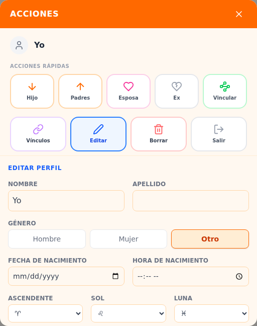
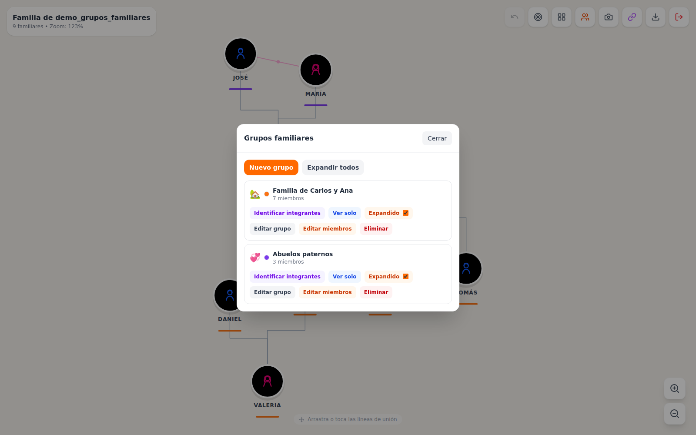
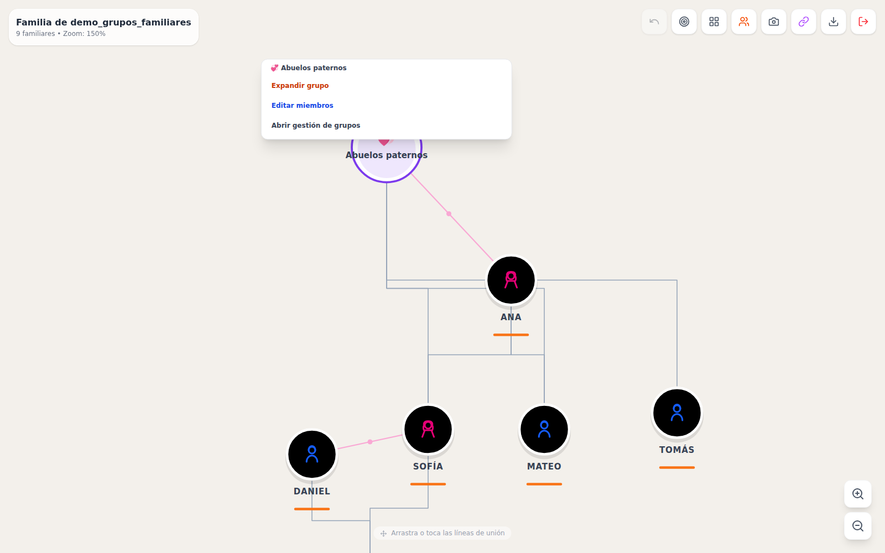
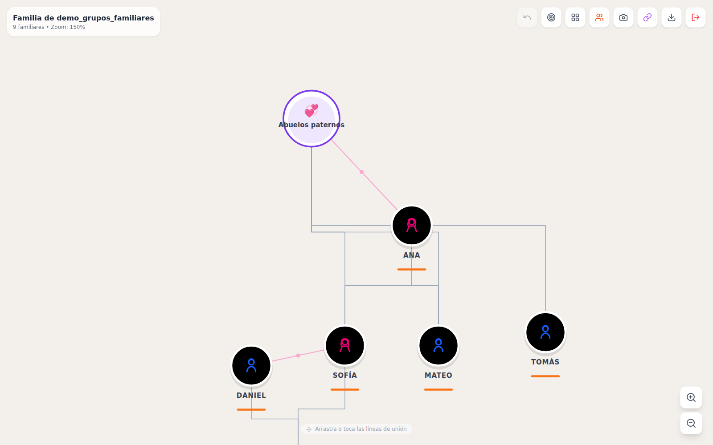
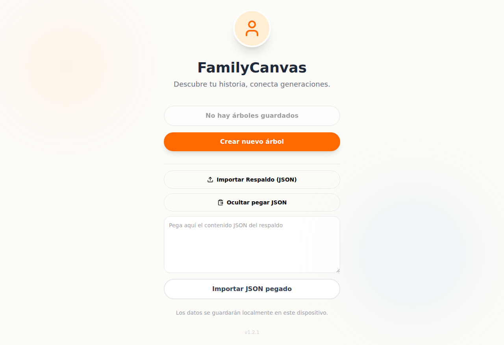
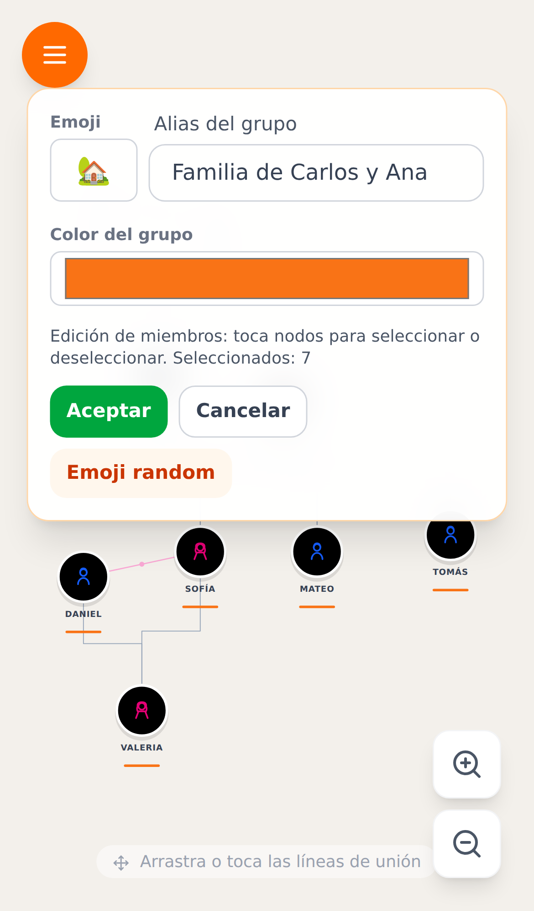

# 🌳 FamilyCanvas – Árbol Genealógico Interactivo

> Descubre tu historia, conecta generaciones.

FamilyCanvas es una aplicación web progresiva (PWA) para crear y visualizar árboles genealógicos de forma visual e interactiva. Funciona completamente en el navegador, sin servidor propio, y ofrece dos modos de almacenamiento: **local** (datos en el navegador) y **nube** (Google Sign-in + Firestore).

---

## Índice

- [✨ Funcionalidades](#-funcionalidades)
- [📸 Capturas de pantalla](#-capturas-de-pantalla)
- [🛠️ Tecnologías](#️-tecnologías)
- [🚀 Levantar en local](#-levantar-en-local)
- [🔥 Configuración Firebase (modo nube)](#-configuración-firebase-modo-nube)
- [📦 Scripts disponibles](#-scripts-disponibles)
- [🏗️ Arquitectura](#️-arquitectura)
- [🌐 Despliegue](#-despliegue)
- [🤝 Contribuir](#-contribuir)

---

## ✨ Funcionalidades

### Canvas interactivo
- Arrastrar y soltar nodos en un lienzo infinito
- Zoom con rueda del ratón / gestos de pellizco (móvil)
- Botón "Centrar vista" para ajustar todos los nodos a la pantalla
- Modos de líneas: **curvas** o **geométricas**
- Deshacer hasta 5 acciones recientes

### Personas y relaciones
- Añadir familiares con nombre, apellido, género, fecha de nacimiento/fallecimiento
- Coordenadas GPS de nacimiento para cálculo de posición solar y lunar
- Signos astrológicos (solar, lunar, ascendente) calculados automáticamente
- Tipos de relación: pareja, ex-pareja, vínculo personalizado
- Vínculos personalizados con nombre, color y estilo visual propios

### Modos de visualización
| Modo | Descripción |
|------|-------------|
| **Todo** | Muestra todos los nodos y relaciones |
| **Árbol** | Rama de ancestros/descendientes a partir de un nodo foco |
| **Linaje** | Vista de árbol genealógico vertical |
| **Radial** | Diagrama en abanico centrado en el nodo foco |

### Grupos familiares
- Crear grupos con nombre, emoji y color
- Aislar un grupo (ocultar el resto del árbol)
- Colapsar grupos en un burbuja resumen en el canvas
- Identificar miembros automáticamente a partir de las relaciones

### Organización automática
- **Niveles**: organiza por generaciones (niveles de nacimiento)
- **Aizado**: disposición estética tipo árbol
- **Atómico**: agrupación por núcleos familiares
- **Lupa**: navegación jerárquica con bolsas comprimibles

### Exportar / Importar
- Exportar el árbol completo como archivo `.json`
- Importar un `.json` desde archivo o pegando el contenido directamente
- Descargar una captura PNG del árbol visible

### Modo nube (Firebase)
- **Sign in con Google** — sin contraseñas
- Los datos se guardan en Firestore en tiempo real
- La sesión persiste entre recargas del navegador
- Botón "Importar datos" en el canvas para cargar un JSON de respaldo

### PWA
- Instalable como app nativa en Android, iOS y escritorio
- Funciona sin conexión para árboles ya cargados

---

## 📸 Capturas de pantalla

> Las imágenes de las funcionalidades principales se encuentran en el directorio [`screenshots/`](./screenshots/).

| Funcionalidad | Imagen |
|---|---|
| Formulario de edición (colapsado) |  |
| Formulario de edición (expandido) |  |
| Selector de fecha/hora tipo rueda |  |
| Selector de signos zodiacales |  |
| Edición con zodíaco completo |  |
| Modal de gestión de grupos |  |
| Menú de grupo colapsado en canvas |  |
| Edición de miembros en canvas |  |
| Importar pegando JSON |  |
| Selector de miembros en móvil |  |

> 📂 **`screenshots/images/`** — reservado para evidencias visuales de las pantallas principales de la aplicación (Landing, Canvas, modos de visualización, etc.). Se poblarán con capturas reales.

---

## 🛠️ Tecnologías

| Capa | Tecnología |
|------|-----------|
| UI | React 19 + Tailwind CSS v4 |
| Iconos | Lucide React |
| Build | Vite 8 |
| PWA | vite-plugin-pwa (Workbox) |
| Auth | Firebase Authentication (Google) |
| Base de datos | Cloud Firestore |
| Hosting | Firebase Hosting |
| Astrología | astronomy-engine |
| Tests | Vitest + Testing Library |
| Linting | ESLint 9 + React Compiler rules |

---

## 🚀 Levantar en local

### Requisitos

- **Node.js 20+** (recomendado: 24)  
- **npm 10+**

### 1. Clonar el repositorio

```bash
git clone https://github.com/molayadev/mola-family-tree.git
cd mola-family-tree
```

### 2. Instalar dependencias

```bash
npm install
```

### 3. Configurar variables de entorno

```bash
cp .env.example .env.local
```

Edita `.env.local` con los valores de tu proyecto Firebase (ver [FIREBASE.md](./FIREBASE.md)):

```dotenv
VITE_FIREBASE_API_KEY=AIza...
VITE_FIREBASE_AUTH_DOMAIN=tu-proyecto.firebaseapp.com
VITE_FIREBASE_PROJECT_ID=tu-proyecto
VITE_FIREBASE_STORAGE_BUCKET=tu-proyecto.firebasestorage.app
VITE_FIREBASE_MESSAGING_SENDER_ID=123456789
VITE_FIREBASE_APP_ID=1:123456789:web:abcdef
```

> **Modo solo local (sin Firebase):** La app funciona completamente sin estas variables. El modo local (datos en localStorage) no las necesita. Solo el botón "Continuar con Google" quedará inactivo si no están configuradas.

### 4. Arrancar el servidor de desarrollo

```bash
npm run dev
```

Abre [http://localhost:5173](http://localhost:5173) en tu navegador.

---

## 🔥 Configuración Firebase (modo nube)

Consulta la guía completa en **[FIREBASE.md](./FIREBASE.md)**, que cubre:

- Crear el proyecto en Firebase Console
- Habilitar Google Authentication
- Configurar Firestore y las reglas de seguridad
- Pasar las variables de entorno a GitHub Actions

---

## 📦 Scripts disponibles

| Comando | Descripción |
|---------|-------------|
| `npm run dev` | Servidor de desarrollo con HMR |
| `npm run build` | Build de producción en `dist/` |
| `npm run preview` | Previsualizar el build de producción |
| `npm run lint` | Ejecutar ESLint |
| `npm run test` | Ejecutar tests unitarios (Vitest) |
| `npm run test:watch` | Tests en modo watch |

---

## 🏗️ Arquitectura

El proyecto sigue una **arquitectura hexagonal** (ports & adapters):

```
src/
├── domain/               # Lógica de negocio pura (sin dependencias externas)
│   ├── config/           # Constantes, estrategias de nodos y modos de vista
│   ├── entities/         # Fábricas de entidades (Node, Edge…)
│   ├── ports/            # Interfaces (StoragePort)
│   └── utils/            # Utilidades de dominio (grupos, linaje, abanico…)
│
├── application/          # Casos de uso y orquestación
│   ├── hooks/            # React hooks de aplicación (useCanvas, useNodeActions…)
│   ├── services/         # Servicios (AuthService, TreeService, ExportImportService…)
│   └── utils/            # Utilidades de aplicación
│
├── infrastructure/       # Implementaciones concretas (adapters)
│   ├── adapters/
│   │   ├── LocalStorageAdapter.js   # Modo local (datos en navegador)
│   │   ├── FirestoreAdapter.js      # Modo nube (Firestore)
│   │   └── FirebaseAuthAdapter.js   # Google Auth
│   └── firebase/
│       └── firebaseConfig.js        # Inicialización Firebase
│
└── ui/                   # Capa de presentación (React)
    ├── App.jsx            # Raíz: gestiona authMode y selección de adaptador
    ├── components/
    │   ├── auth/          # LandingPage, AuthForm
    │   ├── canvas/        # FamilyCanvas, CanvasHUD, FamilyNode, FamilyEdge…
    │   ├── common/        # Button, etc.
    │   └── modals/        # NodeActionsModal, ImportJsonModal, FamilyGroupsModal…
    └── config/            # Configuración de íconos de modos de vista
```

### Modos de almacenamiento

`App.jsx` instancia el adaptador correcto según el método de login y lo inyecta en los servicios de aplicación:

```
authMode = 'local'    →  LocalStorageAdapter  →  TreeService / ExportImportService
authMode = 'firebase' →  FirestoreAdapter     →  TreeService / ExportImportService
```

Los servicios de aplicación no saben qué adaptador usan — solo hablan con `StoragePort`.

---

## 🌐 Despliegue

El repositorio tiene dos workflows de GitHub Actions:

| Workflow | Trigger | Destino |
|----------|---------|---------|
| `deploy.yml` | Push a `main` | Firebase Hosting (producción) |
| `deploy-pr-preview.yml` | Pull Request a `main` | Canal de preview por PR (2 días) |

Ambos usan:
- `FIREBASE_SERVICE_ACCOUNT` — Secret con el JSON de la cuenta de servicio Firebase
- `VITE_FIREBASE_*` — Secrets individuales con la configuración del SDK web

Ver [FIREBASE.md § 7](./FIREBASE.md#7-despliegue-github-actions--secrets) para instrucciones detalladas.

---

## 🤝 Contribuir

1. Haz fork del repositorio
2. Crea una rama: `git checkout -b feat/mi-funcionalidad`
3. Asegúrate de que lint y tests pasan: `npm run lint && npm test`
4. Abre un Pull Request a `main` — se desplegará automáticamente un preview

---

<p align="center">
  Hecho con ❤️ por <a href="https://github.com/molayadev">molayadev</a>
</p>
